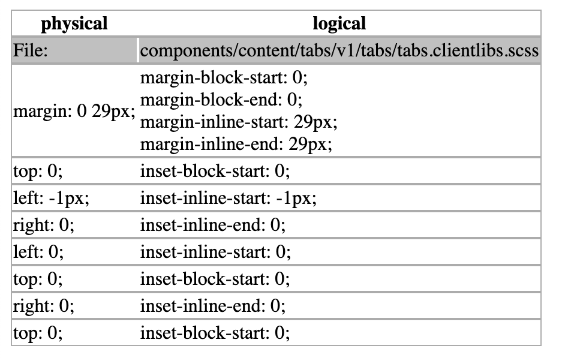
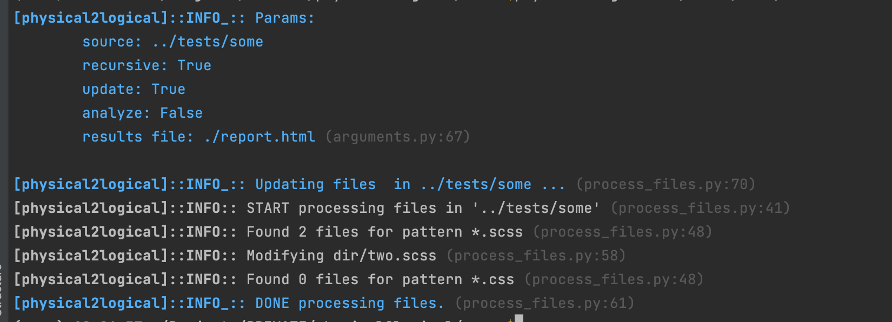
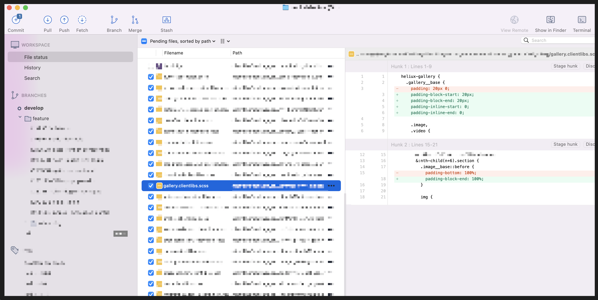

# physical2logical

Convert CSS physical properties to logical.

Converts margins, padding, and borders to logical values, allowing RTL and vertical languages to show correctly.

## Install

```commandline
pip install physical2logical
```

## Usage

```commandline
usage: css2logical [-h] [-r | --recursive | --no-recursive] [-u | --update | --no-update] [-a | --analyze | --no-analyze] [-f FILENAME]  [-l LOG] [-p PATTERN] source

Convert CSS physical properties to logical

positional arguments:
  source                Path to source directory or one file. Required

optional arguments:
  -h, --help            show this help message and exit
  -r, --recursive, --no-recursive
                        Recursive process of all files from source directory. (default: True)
  -u, --update, --no-update
                        Update files. (default: False)
  -a, --analyze, --no-analyze
                        Dry Run - Create a report with all changes (without actual source file changes). (default: False)
  -f FILENAME, --filename FILENAME
                        Path to file where to save reports (used only with -a | --analyze flag). (default: "./report.html")
  -l LOG, --log LOG     Log Level: All: 0, Debug: 10, Info: 20, Warning: 30, Error: 40 (default: 0)
  -p PATTERN, --pattern PATTERN
                        Comma separated list of glob patterns (default: '*.scss, *.css')


```

Based on https://gist.github.com/nyurik/d438cb56a9059a0660ce4176ef94576f

## Report



## Example

```commandline
css2logical -u ./src/scss/
```




